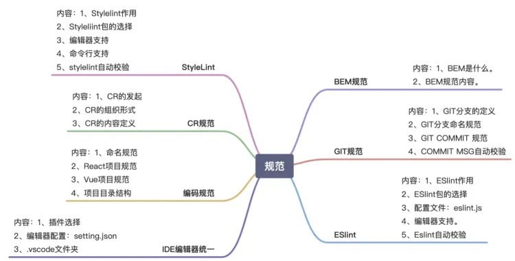

### 问题

- 开发编码没有规范，命名随意，代码风格差异大，可读性差；不利于实现代码提交检查。
- 项目架构没有规范，项目结构不同，不利于统一维护；不利于开发流程统一。
- 版本管理没有规范，commit 过多，注释随意，不利于项目管理，不利于持续集成。
- 项目流程、发布流程，规范不明确，合作开发容易造成发布异常，需结合发布平台做规范梳理。
- 团队合作规范不明确，不利于沟通和任务划分。
- IDE 编辑器不统一，编辑器配置不统一

### 目标

- [ ] 统一前端内部规范，通过组织讨论会及问卷调查优化规范。
- [ ] 制定 es-lint、pre commit、pre build 工具，为持续集成做准备。
- [ ] 制定各规范（基础规范、编码规范、版本管理规范、项目流程规范、文档规范、数据上报规范）
- [ ] 统一 IDE 编辑器，项目内置编辑器配置

### [相关 demo](https://github.com/xiaozhi666666/webpackdemo)

> 本栏主要针对前端项目的代码规范配置，使用 VSCode 文本编辑器及其插件配置。

```mdx-code-block
import DocCardList from '@theme/DocCardList';

<DocCardList />
```
