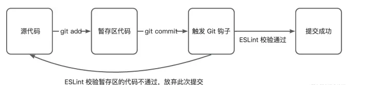

:::tip

1. 如果想要开发者提交符合 ESLint 校验的代码，可以使用 husky 配合 lint-staged 工具实现。两者配合使用可以实现在提交说明时自动
2. 使用 ESLint 检查 Git 暂存区的代码，一旦存在 💩 一样不符合校验规则的代码，则会放弃提交行为
3. lint-staged：该工具只会检查放在 Git 暂存区的代码
4. Husky：使用 Git 的 pre-commit 钩子配合 ESLint 进行代码提交前的代码检查
5. pre-commit exit 非 0 就会推出本次提交
   :::

### husky prepare 命令

```json
"scripts": {
  // 执行yarn 或 npm install 会自动执行
  "prepare": "husky install"
},
```

### 安装

```bash
yarn add husky -D
# 在项目根目录执行下述命令
# 会在 pacakge.json 的 scripts 字段中生成 "prepare": "husky install"
# 上传到远程仓库后，别的开发者同步代码并使用 yarn 安装依赖后，会自动触发 husky install
yarn prepare
```

### 在 package.json 中添加以下代码

```json
"lint-staged": {
  "*.{ts,tsx,js}": [
    "eslint --config .eslintrc.js"
  ],
  "*.{css,less}": [
    "stylelint --fix",
    "stylelint --config .stylelintrc.js"
  ],
  "*.{ts,tsx,js,json,html,yml,css,less,md}": [
    "prettier --write"
  ]
},
"husky": {
  "hooks": {
    "pre-commit": "lint-staged"
  }
},
```

### 执行成功后，可以发现，在项目根目录自动生成了 .husky 目录：

```bash
├── .husky
│   └── -   # _ 目录不会提交到远程仓库，yarn prepare 自动生成
│       ├── .gitignore
│       └── husky.sh
├── .vscode/
├── node_modules/
```

### 然后执行下面指令，将 npm run lint 加入到 pre-commit 中

```bash
# 1、如果项目的 node_modules/bin 目录下能够找到 husky 命令，则优先使用命令对应的执行脚本
# 2、如果本地项目中没有，那么会临时下载 NPM 包到缓存目录中，并将其添加到操作系统的环境变量 PATH 中
npx husky add .husky/pre-commit "npm run lint"
```

```bash
├── .husky
│   └── -           # _ 目录不会提交到远程仓库， husky install 自动生成
│       ├── .gitignore
│       └── husky.sh
│   └── pre-commit  # 执行 husky add 之后新增的 Git 钩子 pre-commit
├── .vscode/
├── node_modules/
├── build/
```

#### 这样在 git commit 时就会执行 npm run lint 操作，来校验代码
