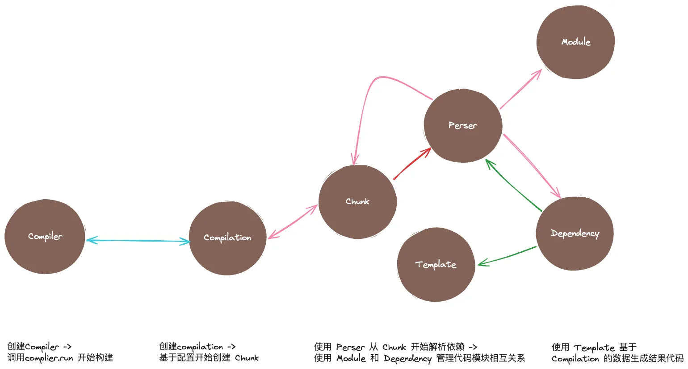
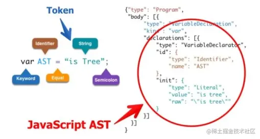

:::tip
webpack 引以为傲的几个东西，都是抄的，哈哈哈

- treeshaking rollup 抄的
- 缓存体系 cache-loader 的
- 把生态里面做的好的插件直接揉进来，太坏了
  :::

## 1. js 编译过程

:::tip

1. 💡js 会先编译成字节码，字节码通过 V8 转换成机器码
2. 💡webpack 引入 v8-complie-cache 做机器码缓存优化，不过后面去掉了，webpack 内置了一个编辑器
   :::

## 2. webpack5 引入了 prepack，可以很好的简化代码

:::tip
开发环境不会执行 prepack 的
prepack 将代码转换成 AST 抽象语法树，对你的代码做一次预执行，并对你的代码做一些合并
:::

## 3. webpack 源码

### 3.1 webpack 工作流程


:::tip
能说一下 webpack 原理和新的模块么？

1. Compiler 是 webpack 的总调度器 Complier.run 执行后，开始构建
2. complier 调用 compilation 开始创建 Chunk
3. compilation 通过 perser 解析 Chunk 生成 AST 语法树，通过 Template 生成结果代码
4. 通过 Module 和 Dependency 管理代码模块关系，
5. 递归解析依赖根据 Template 模块，生成结果代码
   :::

### 3.2 webpack 源码分析

- webpack 运行时会找到 node_module 中 webpack 中的 bin 文件
- webpack.js 文件，首先会判断 webpack-cli 是否安装，如果没安装就会提示你是否使用 xxx 安装
- 如果安装了 webpack-cli 的就会执行 runCli
- runCli 首先会拿到 package.json 的包，得到项目的路径

```javascript
#!/usr/bin/env node

/**
 * @param {string} command process to run
 * @param {string[]} args command line arguments
 * @returns {Promise<void>} promise
 */
const runCommand = (command, args) => {
  const cp = require("child_process");
  return new Promise((resolve, reject) => {
    const executedCommand = cp.spawn(command, args, {
      stdio: "inherit",
      shell: true,
    });

    executedCommand.on("error", (error) => {
      reject(error);
    });

    executedCommand.on("exit", (code) => {
      if (code === 0) {
        resolve();
      } else {
        reject();
      }
    });
  });
};

/**
 * @param {string} packageName name of the package
 * @returns {boolean} is the package installed?
 */
const isInstalled = (packageName) => {
  if (process.versions.pnp) {
    return true;
  }

  const path = require("path");
  const fs = require("graceful-fs");

  let dir = __dirname;

  do {
    try {
      if (
        fs.statSync(path.join(dir, "node_modules", packageName)).isDirectory()
      ) {
        return true;
      }
    } catch (_error) {
      // Nothing
    }
  } while (dir !== (dir = path.dirname(dir)));

  // https://github.com/nodejs/node/blob/v18.9.1/lib/internal/modules/cjs/loader.js#L1274
  // eslint-disable-next-line no-warning-comments
  // @ts-ignore
  for (const internalPath of require("module").globalPaths) {
    try {
      if (fs.statSync(path.join(internalPath, packageName)).isDirectory()) {
        return true;
      }
    } catch (_error) {
      // Nothing
    }
  }

  return false;
};

/**
 * @param {CliOption} cli options
 * @returns {void}
 */
const runCli = (cli) => {
  const path = require("path");
  const pkgPath = require.resolve(`${cli.package}/package.json`);
  // eslint-disable-next-line node/no-missing-require
  const pkg = require(pkgPath);

  if (pkg.type === "module" || /\.mjs/i.test(pkg.bin[cli.binName])) {
    // eslint-disable-next-line node/no-unsupported-features/es-syntax
    import(path.resolve(path.dirname(pkgPath), pkg.bin[cli.binName])).catch(
      (error) => {
        console.error(error);
        process.exitCode = 1;
      }
    );
  } else {
    // eslint-disable-next-line node/no-missing-require
    require(path.resolve(path.dirname(pkgPath), pkg.bin[cli.binName]));
  }
};

/**
 * @typedef {Object} CliOption
 * @property {string} name display name
 * @property {string} package npm package name
 * @property {string} binName name of the executable file
 * @property {boolean} installed currently installed?
 * @property {string} url homepage
 */

/** @type {CliOption} */
const cli = {
  name: "webpack-cli",
  package: "webpack-cli",
  binName: "webpack-cli",
  installed: isInstalled("webpack-cli"),
  url: "https://github.com/webpack/webpack-cli",
};

if (!cli.installed) {
  const path = require("path");
  const fs = require("graceful-fs");
  const readLine = require("readline");

  const notify =
    "CLI for webpack must be installed.\n" + `  ${cli.name} (${cli.url})\n`;

  console.error(notify);

  let packageManager;

  if (fs.existsSync(path.resolve(process.cwd(), "yarn.lock"))) {
    packageManager = "yarn";
  } else if (fs.existsSync(path.resolve(process.cwd(), "pnpm-lock.yaml"))) {
    packageManager = "pnpm";
  } else {
    packageManager = "npm";
  }

  const installOptions = [packageManager === "yarn" ? "add" : "install", "-D"];

  console.error(
    `We will use "${packageManager}" to install the CLI via "${packageManager} ${installOptions.join(
      " "
    )} ${cli.package}".`
  );

  const question = `Do you want to install 'webpack-cli' (yes/no): `;

  const questionInterface = readLine.createInterface({
    input: process.stdin,
    output: process.stderr,
  });

  // In certain scenarios (e.g. when STDIN is not in terminal mode), the callback function will not be
  // executed. Setting the exit code here to ensure the script exits correctly in those cases. The callback
  // function is responsible for clearing the exit code if the user wishes to install webpack-cli.
  process.exitCode = 1;
  questionInterface.question(question, (answer) => {
    questionInterface.close();

    const normalizedAnswer = answer.toLowerCase().startsWith("y");

    if (!normalizedAnswer) {
      console.error(
        "You need to install 'webpack-cli' to use webpack via CLI.\n" +
          "You can also install the CLI manually."
      );

      return;
    }
    process.exitCode = 0;

    console.log(
      `Installing '${
        cli.package
      }' (running '${packageManager} ${installOptions.join(" ")} ${
        cli.package
      }')...`
    );

    runCommand(packageManager, installOptions.concat(cli.package))
      .then(() => {
        runCli(cli);
      })
      .catch((error) => {
        console.error(error);
        process.exitCode = 1;
      });
  });
} else {
  runCli(cli);
}
```

### 3.3 怎么去写一个 plugin

- plugin 通常是一个类。这个类包含一个 apply 方法
- apply 方法是插件的入口点。webpack 会在安装插件时调用这个方法。它接收一个 complier 对象的引用，可以通过这个对象访问 webpack 环境

```javascript
class MyExamplePlugin {
  // apply 是给 webpack 调用的
  apply(compiler) {
    // 绑定到 'done' 钩子，构件完成时触发
    compiler.hooks.done.tap("MyExamplePlugin", (compilation) => {
      console.log("Hello from MyExamplePlugin");
    });
  }
}
module.exports = MyExamplePlugin;
```

### 3.4 怎么去手写一个 loader

:::tip
webpack 内置了一些 loader 比如 cache-loader ，webpack5 不需要再去使用 file-loader，有关文件的内容，都不需要去额外处理
:::

- loader 本质上是一个导出为函数的 JavaScript 模块，这个函数会在 webpack 处理文件时调用
- 它导出了一个函数，该函数接收一个参数 source，这个是文件的原始内容
- 利用 source 处理文件
- 最后 return

```javascript
module.exports = function (source) {
  const reversed = source.split("").reverse().join("");

  return `module.exports = ${JSON.stringify(reversed)}`;
};
```

### 3.5 手写一个 webpack

- index.js

```javascript
const webpack = require("./webpack");
const options = require("../webpack.config.js");
const compiler = webpack(options);

compiler.run((err) => {
  if (err) {
    console.log("编译出错", err);
  }
});
```

- webpack.js

```javascript
const Compiler = require("./Compiler.js");
const webpack = function (options) {
  const compiler = new Compiler(options);
  if (Array.isArray(options.plugins)) {
    for (const plugin of options.plugins) {
      plugin.apply(compiler);
    }
  }
  return compiler;
};
module.exports = webpack;
```

- Compiler.js

```javascript
const { SyncHook } = require('tapable');
const Compilation require('./Compilation.js');
const { join } = require('path');
const fs = require('fs');

class Compiler = {
  constructor(options) {
    this.options = options;
    this.entry = options.entry;
    this.output = options.output;
    this.modules = [];
    this.hooks = {
      run: new SyncHook(['compilation'])
    }
  }
  run(callback) {
    console.log('开始构建')；
    const onCompiled = (err, compilation) => {
      // 生成静态文件
      this.emitAssets(compilation, err =>{});
    };
    this.compile(onCompiled)
  }
  compile(callback) {
    const compilation = this.newCompilation();
    // 要把之前插件注册的生命周期开始调度
    this.hooks.run.call(compilation)
    compilation.seal(callback)
  }
  newCompilation() {
    const compilation = this.createCompilation();
    return compilation
  }
  createCompilation() {
    return new Compilation(this)
  }
  emitAssets(compilation) {
    console.log('[生成dist main.js文件]');
    console.log('接收的文件', compilation);
    const outputPath = join(this.output.path, this.output.filename);
    let _modules = '';
    this.modules.map((_module) => {
      _modules += `"${_module.filename}":(module, exports, require) => {
                    ${_module.transformCode}
                  }`;
    })
    console.log('[modules 完成]')
    // 生成的模版，太长没搞, 可以参考lib下的ChunkTemplate.js文件
    const template = '';
    fs.writefileSync(outputPath, template, 'utf-8')
  }
}
module.exports = Compiler
```

- Compilation.js

```javascript
const { join } = require("path");
const Parser = require("./Parser.js");

class Compilation {
  constructor(Compiler) {
    const { options, modules } = compiler;
    this.options = options;
    this.modules = modules;
  }
  seal(callback) {
    const entryModule = this.buildModule(this.option.entry, true);
    console.log("[封装对应的entry 和 chunk]");
    this.modules.push(entryModule);
    // 递归
    this.modules.map((_module) => {
      _modules.dependencies.map((dependency) => {
        this.modules.push(this.buildModule(dependency, false));
      });
    });
    console.log("[封装对应的entry 和 chunk完成]");
    callback(null, this);
  }
  buildModule(filename, isEntry) {
    console.log("____filename___", filename);
    let absolutePath = "";
    let ast = "";
    if (!isEntry) {
      absolutePath = join(process.cwd(), "./src/", filename);
      ast = Parser.parse(absolutePath);
    } else {
      ast = Parser.parse(filename);
    }

    const dependencies = Parser.getDependencies(ast);
    const transformCode = Parser.transform(ast);
    return {
      filename,
      dependencies,
      transformCode,
    };
  }
}
module.exports = Compilation;
```

- Parser.js 源码使用的是 acorn ，我这里使用 babylon

````javascript
// 遍历ast树的
const babylon = require('babylon');
const traverse = require('babel-traverse').default;
const fs = reuqire('fs');
const { transformFromAstSync } = require('@babel/core')

class Perser {
  static parse(path) {
    const content = fs.readFileSync(path, 'utf8');
    return babylon.parse(content, {
      sourceType: 'module'
    })
  }
  // 获取模块依赖
  static getDependencies(ast) {
    const dependencies = [];
    traverse(ast, {
      ImportDeclaration({node}) {
        dependencies.push(node.source.value)
      }
    })
    return dependencies
  }
  static transform(ast) {
    const { code } = transformFromAstSync(ast, null, {
      parsets: ['@babel/preset-env']
    });
    return code
  }
}
module.exports = Parser;
	```
````

- @babel/core 要锁下版本 7.12.3 @babel/preset-env 锁 7.15.6

```javascript
const { join } = require("path");
const ConsoleLogOnBuildWebpackPlugin = require("./plugins/ConsoleLogOnBuildWebpackPlugin");

module.exports = {
  entry: join(__dirname, "./src/index.js"),
  output: {
    path: join(__dirname, "./dist"),
    filename: "main.js",
  },
  plugins: [new ConsoleLogOnBuildWebpackPlugin()],
};
```

### 3.6 AST 静态语法分析树


